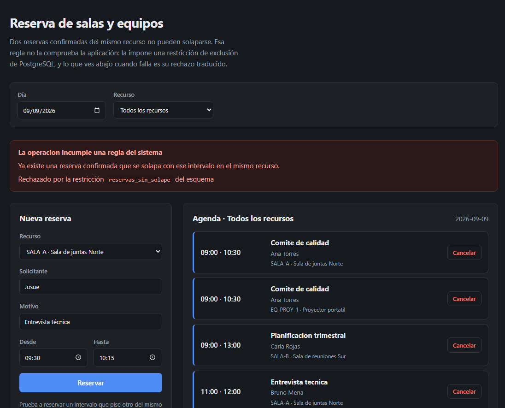

# Reserva de salas y equipos: la regla de negocio en la base de datos

[](https://github.com/jhosuechica/reservas-recursos/actions/workflows/ci.yml)
[](https://openjdk.org/projects/jdk/21/)
[](https://spring.io/projects/spring-boot)
[](https://angular.dev/)
[](https://www.postgresql.org/)
[](LICENSE)

Un sistema para reservar salas y equipos, con una sola regla que lo define:
**dos reservas confirmadas del mismo recurso no pueden solaparse en el tiempo.**

Lo que este proyecto intenta demostrar no es que se sepa construir un CRUD, sino
**dónde conviene que viva una regla de integridad**. Aquí no la comprueba el
servicio antes de escribir: la impone una restricción de exclusión de
PostgreSQL, así que no hay forma de saltársela ni carrera posible entre dos
peticiones simultáneas. El servicio se limita a intentar la escritura y a
traducir el rechazo.

Esa decisión, con lo que cuesta, está en
[docs/adr/0001](docs/adr/0001-la-regla-vive-en-el-esquema.md).



Lo que se ve arriba es el sistema rechazando una reserva de 09:30 a 10:15 sobre
una sala que ya está ocupada de 09:00 a 10:30. El mensaje no dice «error»: dice
qué restricción del esquema la rechazó.

---

## Tabla de contenido

- [La regla que define el sistema](#la-regla-que-define-el-sistema)
- [Puesta en marcha](#puesta-en-marcha)
- [Por qué no se comprueba antes de insertar](#por-qué-no-se-comprueba-antes-de-insertar)
- [API](#api)
- [La interfaz](#la-interfaz)
- [Pruebas](#pruebas)
- [Estructura del repositorio](#estructura-del-repositorio)
- [Decisiones técnicas](#decisiones-técnicas)
- [Limitaciones conocidas](#limitaciones-conocidas)
- [Autor](#autor)

---

## La regla que define el sistema

Toda la lógica interesante cabe en una declaración del esquema:

```sql
ALTER TABLE reservas
    ADD CONSTRAINT reservas_sin_solape
    EXCLUDE USING gist (
        recurso_id                   WITH =,
        tstzrange(inicio, fin, '[)') WITH &&
    )
    WHERE (estado = 'CONFIRMADA');
```

Tres detalles que no son casuales:

**`WITH =` junto a `WITH &&`.** Se prohíben las filas que compartan recurso y
además solapen intervalo. Combinar un operador de igualdad con uno de rango en
el mismo índice GiST necesita la extensión `btree_gist`.

**El rango es `'[)'`.** Incluye el inicio y excluye el fin, así que una reserva
de 9 a 10 y otra de 10 a 11 no chocan. Con `'[]'` el sistema rechazaría
reuniones consecutivas, que es el caso más normal de todos. Está en el
[ADR-0003](docs/adr/0003-el-rango-es-semiabierto.md).

**El `WHERE` la hace parcial.** Solo se aplica a las reservas confirmadas, así
que cancelar libera el hueco sin borrar la fila y el histórico se conserva. Está
en el [ADR-0004](docs/adr/0004-cancelar-en-lugar-de-borrar.md).

El esquema completo está en
[`V1__esquema.sql`](backend/src/main/resources/db/migration/V1__esquema.sql).

---

## Puesta en marcha

**Requisitos:** Docker Desktop. Nada más: Java, Maven y Node se ejecutan dentro
de las imágenes.

```bash
git clone https://github.com/jhosuechica/reservas-recursos.git
```

```bash
cd reservas-recursos && cp .env.example .env
```

Edita `.env` y pon una contraseña propia en `POSTGRES_PASSWORD`. Luego:

```bash
docker compose up -d --build
```

La primera vez compila el backend y el frontend, así que tarda varios minutos.
Cuando termine, comprueba que los tres contenedores estén sanos:

```bash
docker compose ps
```

Con los tres en `healthy`:

```bash
bash scripts/prueba-humo.sh
```

Diecisiete comprobaciones que recorren el sistema y verifican, una a una, las
afirmaciones que sostiene este README. No solo que los servicios respondan:
también que una reserva solapada se rechace, que una consecutiva se acepte y
que cancelar libere el hueco.

| Servicio | URL |
|---|---|
| Aplicación | http://localhost:4200 |
| API | http://localhost:8080/api |
| Estado del backend | http://localhost:8080/actuator/health |

Para dejarlo todo como estaba, incluida la base de datos:

```bash
docker compose down -v
```

---

## Por qué no se comprueba antes de insertar

La forma habitual de implementar esta regla es consultar y después escribir:

```java
if (reservas.existeSolapamiento(recursoId, inicio, fin)) {
    throw new ConflictoDeReserva(...);
}
reservas.save(nueva);
```

Funciona en las pruebas manuales y falla en producción, por dos motivos.

**Hay una carrera entre la consulta y la escritura.** Dos peticiones
simultáneas para la misma sala consultan a la vez, las dos ven el hueco libre y
las dos insertan. Con el nivel de aislamiento por defecto de PostgreSQL ninguna
ve la fila que la otra aún no ha confirmado. La ventana dura milisegundos, así
que no aparece probando a mano, pero está siempre.

**La regla hay que repetirla en cada vía de escritura.** El día que se añada una
importación masiva o un endpoint nuevo, alguien tiene que acordarse. Si no lo
hace, nada avisa.

Con la restricción, el servicio hace lo contrario: escribe y traduce el rechazo.

```java
try {
    // saveAndFlush, no save: el INSERT tiene que salir dentro del try.
    // Con save, la violación salta al confirmar la transacción, ya fuera.
    return reservas.saveAndFlush(reserva);
} catch (DataIntegrityViolationException excepcion) {
    throw TraductorDeRestricciones.traducir(excepcion);
}
```

El traductor convierte el nombre de la restricción en un mensaje con sentido y
responde un 409 con formato RFC 7807. El texto crudo de PostgreSQL nunca sale
al exterior: nombra tablas e índices, que describen la instalación por dentro.

```json
{
  "type": "about:blank",
  "title": "La operación incumple una regla del sistema",
  "status": 409,
  "detail": "Ya existe una reserva confirmada que se solapa con ese intervalo en el mismo recurso.",
  "restriccion": "reservas_sin_solape"
}
```

---

## API

Todas las rutas cuelgan de `/api`. El frontend las llama en relativo, así que
Nginx hace de proxy y no hay CORS.

| Método | Ruta | Qué hace |
|---|---|---|
| `GET` | `/api/recursos?soloActivos=true` | Lista salas y equipos |
| `GET` | `/api/recursos/{id}` | Un recurso |
| `POST` | `/api/recursos` | Da de alta un recurso |
| `GET` | `/api/reservas?recursoId=&desde=&hasta=` | Agenda; sin fechas, el día de hoy |
| `GET` | `/api/reservas/{id}` | Una reserva |
| `POST` | `/api/reservas` | Crea una reserva confirmada |
| `DELETE` | `/api/reservas/{id}` | Cancela; devuelve la reserva ya cancelada |

La agenda devuelve lo que **se cruza** con la ventana pedida, no lo que empieza
dentro: una reserva que arrancó ayer y sigue hoy aparece en la agenda de hoy.

### Ejemplo

```bash
curl -X POST http://localhost:8080/api/reservas -H 'Content-Type: application/json' -d '{"recursoId":1,"solicitante":"Ana Torres","motivo":"Comite de calidad","inicio":"2026-10-05T09:00:00Z","fin":"2026-10-05T11:00:00Z"}'
```

### Errores

| Código | Cuándo |
|---|---|
| `400` | Faltan campos o no caben. El cuerpo trae `errores` con el detalle por campo |
| `404` | El recurso o la reserva no existen |
| `409` | Una restricción del esquema rechazó la operación. El cuerpo trae `restriccion` |

Un 409 no significa que la petición esté mal formada, sino que el estado actual
del sistema la hace imposible.

---

## La interfaz

Una sola pantalla en Angular 20, con componentes independientes y señales. A la
izquierda el formulario de reserva, a la derecha la agenda del día.

Está construida alrededor del caso que da sentido al proyecto: **cuando la
reserva pisa a otra, la aplicación no dice «error», dice qué restricción del
esquema la rechazó.**

El nombre de la restricción se muestra a propósito. Es lo que hace visible que
la regla la impuso la base de datos y no una comprobación del código, y
convierte un mensaje genérico en algo que se puede rastrear hasta la migración
que lo declara.

Las reservas canceladas se listan aparte en vez de desaparecer, porque cancelar
libera el intervalo sin borrar la fila.

Todas las llamadas van a rutas relativas bajo `/api`. Nginx sirve la aplicación
y hace de proxy hacia el backend, así que el navegador nunca cruza a otro
origen y no hay CORS que configurar.

---

## Pruebas

### Unitarias

11 pruebas sobre `ReservaService` con Mockito, sin base de datos. Comprueban la
traducción de cada restricción, que cancelar sea idempotente, y una que merece
mención: **que el servicio no consulte antes de insertar**. Si alguien añadiera
esa consulta previa, la prueba falla, porque sería reintroducir la carrera que
la restricción elimina.

### Integración

12 pruebas contra un PostgreSQL real con Testcontainers, sobre el mismo esquema
que crea Flyway en producción.

Son imprescindibles aquí: las reglas que verifican no existen en el código Java.
Con una base en memoria, o dejando que Hibernate genere las tablas, estas
pruebas pasarían sin comprobar nada. Por eso el perfil de pruebas ejecuta
Flyway y usa `ddl-auto: validate`.

Cubren el rechazo del solapamiento, que las reservas consecutivas se acepten,
que el mismo horario en recursos distintos se permita, que cancelar libere el
hueco conservando la fila, el tope de duración con su límite exacto, y la
coherencia entre tipo de recurso y capacidad.

```bash
cd backend && mvn verify
```

Necesita Java 21 y Maven en la máquina, además de Docker. Las unitarias corren
en cualquier sitio, porque no tocan Docker.

### Del frontend

5 pruebas con Karma y Jasmine sobre el componente, con el cliente HTTP simulado.
Comprueban que la aplicación pida el catálogo al arrancar, que llame en rutas
relativas para que el proxy funcione, que muestre la restricción que devuelve un
409 y que un fallo de red no deje la pantalla en blanco.

```bash
cd frontend && npm ci && npm test
```

### De humo

17 comprobaciones sobre el sistema levantado, incluida una que verifica que
Nginx enruta `/api` al backend.

Es reejecutable: cada pasada da de alta su propio recurso, así que las reservas
de una ejecución no chocan con las de la siguiente.

```bash
bash scripts/prueba-humo.sh
```

---

## Estructura del repositorio

```
.
├── docker-compose.yml              PostgreSQL, backend y frontend encadenados por estado de salud
├── backend/
│   ├── Dockerfile                  Build multietapa Maven a JRE Alpine, usuario sin privilegios
│   └── src/main/
│       ├── java/.../dominio/       Recurso y Reserva
│       ├── java/.../servicio/      Reglas de aplicación y traducción de restricciones
│       ├── java/.../web/           Controladores y manejador RFC 7807
│       └── resources/db/migration/ V1 el esquema, V2 los datos de ejemplo
├── frontend/
│   ├── Dockerfile                  Build multietapa Node a Nginx
│   ├── nginx.conf                  Fallback de la SPA y proxy de /api
│   └── src/app/                    Una pantalla: agenda, alta y el error del esquema
├── scripts/prueba-humo.sh          Las 17 comprobaciones del sistema completo
└── docs/adr/                       Las cinco decisiones y lo que cuesta cada una
```

---

## Decisiones técnicas

- [ADR-0001 · La regla de no solapamiento vive en el esquema](docs/adr/0001-la-regla-vive-en-el-esquema.md)
- [ADR-0002 · Dos columnas de instante en lugar de una columna de rango](docs/adr/0002-dos-columnas-en-lugar-de-un-rango.md)
- [ADR-0003 · El intervalo es cerrado por la izquierda y abierto por la derecha](docs/adr/0003-el-rango-es-semiabierto.md)
- [ADR-0004 · Cancelar cambia el estado, no borra la fila](docs/adr/0004-cancelar-en-lugar-de-borrar.md)
- [ADR-0005 · La infraestructura se hereda de una plantilla](docs/adr/0005-infraestructura-heredada-de-la-plantilla.md)

El ADR-0001 es el que sostiene el proyecto, y reconoce lo que la decisión
cuesta: ata el sistema a PostgreSQL y convierte el nombre de una restricción en
parte del contrato de la API.

La infraestructura no se escribió aquí. Viene de
[plantilla-spring-angular-docker](https://github.com/jhosuechica/plantilla-spring-angular-docker),
y este repositorio es la comprobación de que esa plantilla funciona: es el
primer proyecto que ejecuta su pipeline entero.

---

## Limitaciones conocidas

- **Sin autenticación.** El sistema no distingue quién llama, así que cualquiera
  puede reservar en nombre de otra persona o cancelar una reserva ajena. Para un
  ejercicio sobre integridad de datos no aporta, pero conviene decirlo.
- **El solicitante es texto libre.** No hay tabla de personas, así que dos
  formas de escribir el mismo nombre son dos solicitantes distintos.
- **Solo funciona con PostgreSQL.** Las restricciones de exclusión no son
  estándar. Cambiar de motor obligaría a rehacer la regla central.
- **El nombre de la restricción es parte del contrato.** El cuerpo del 409 lo
  expone y la traducción depende de él, así que renombrarlo en una migración
  rompe a los clientes.
- **La traducción del error tiene un camino frágil.** Hibernate no siempre
  extrae el nombre de la restricción en las violaciones de exclusión, así que
  hay un respaldo que lo busca en el texto del error de PostgreSQL. Un cambio de
  formato en los mensajes del motor lo rompería en silencio.
- **La tabla de reservas crece indefinidamente.** Las canceladas nunca se
  borran, que es lo buscado, pero no hay archivado.
- **Sin cobertura de los controladores.** Los servicios y la integración con la
  base de datos están cubiertos; las rutas HTTP solo las recorre la prueba de
  humo, no una prueba con `MockMvc`.
- **La duración máxima está fijada en ocho horas** dentro de una migración. Es
  deliberado, para que cambiarla deje rastro, pero significa que no se puede
  ajustar por recurso.

---

## Autor

**Jhosué Chica**, Desarrollador de Software
[LinkedIn](https://www.linkedin.com/in/jhosue-chica-0811a933a) · [GitHub](https://github.com/jhosuechica)
